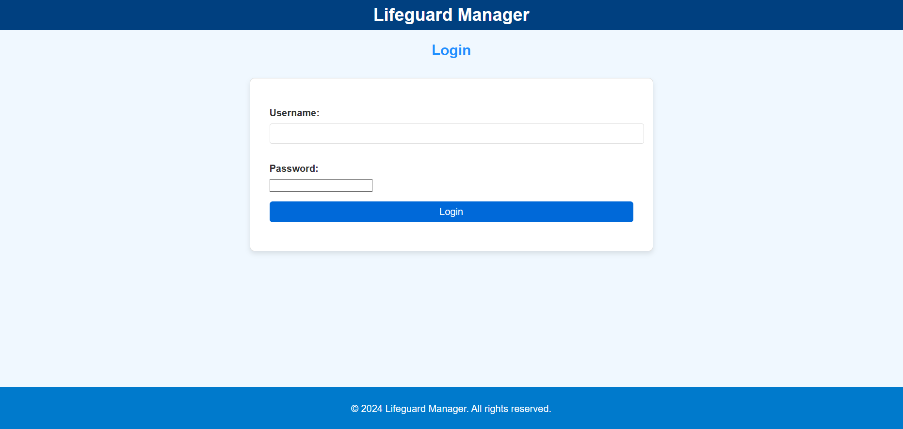
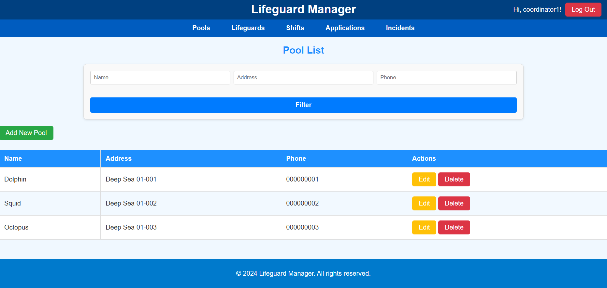
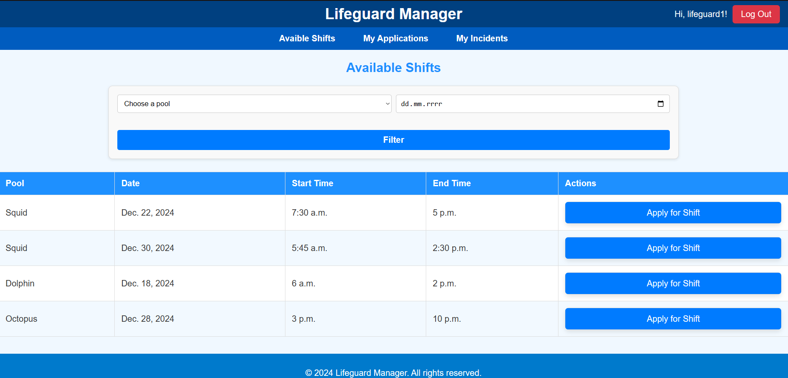
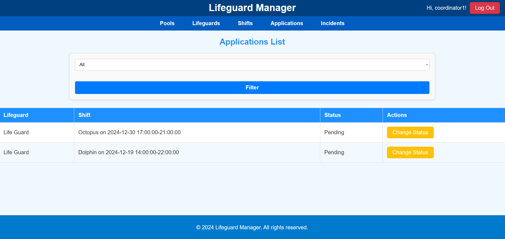

# Lifeguard-Manager
The main goal of the project is to improve the work of a company providing rescue services at swimming pools. It solves people and pool management problems for coordinators and makes it easier for lifeguards to sign up for shifts and report incidents.
# Features
There are two roles in the system: coordinator and lifeguard. Features depend on role.
### Features for coordinator:
* managing pools the company is serving,
* managing lifeguards,
* creating, updating, removing and reading shifts for which the lifeguard can sign up,
* approve/reject application made by lifeguards,
* read all the incidents.
### Features for coordinator:
* applying for shifts (making an application),
* managing incidents.
# Quickstart
### Prerequisites
Ensure you have the following installed on your system:
- [Docker](https://www.docker.com/get-started)
- [Docker Compose](https://docs.docker.com/compose/install/)
### Installation
1. Open terminal and clone repository
2. ```cd Lifeguard-Manager```
3. ```docker-compose up --build -d```
4. Open browser and go to [localhost](http://localhost:80)  

Now u should see the login screen:

If installation went correctly there should be created example data and 3 users:
* login: ```coordinator1```, password: ```Str0ngPa$$word``` - user with coordinator rights,
* logins: ```lifeguard1```, ```lifeguard2```, password: ```Str0ngPa$$word``` - users with lifeguard rights.

There is also administrator role. U have to go on [localhost/admin](http://localhost:8000/admin) and login and passworrd is ```admin```. 
Its all done! I encourage you to explore views and features of the system. Here u have other views in system:
List of pools:

Applying for a shift:

Changing status of the application:

